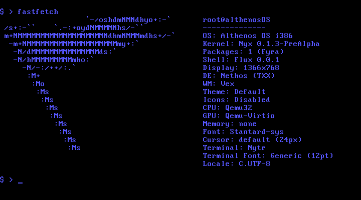

 <h1>AlthenosOS</h1>
  

  

    <strong>AlthenosOS</strong> is an experimental <strong>32-bit operating system</strong> based on Primus-OS, written from scratch in <strong>C and x86 Assembly</strong>, designed with an <strong>educational, modular, and extensible approach</strong>.
    It aims to provide a strong foundation for experimenting with kernels, bootloaders, memory management, file systems, and low-level tools, gradually adopting a more UNIX and BSD-like style.
  

  

  <h2>🌟 Main Features</h2>
  <ul>
    <li>Monolithic 32-bit x86 kernel, freestanding.</li>
    <li>GRUB bootloader compatible with BIOS and multiboot.</li>
    <li>Basic drivers: text VGA, PS/2 keyboard, PIT, PIC.</li>
    <li>Interrupt system (IDT + IRQ + exceptions).</li>
    <li>Basic memory manager (paging + dynamic heap).</li>
    <li>Internal shell with essential commands and future support for external UNIX-like commands.</li>
    <li>Modular architecture with restructured code for easy learning.</li>
    <li>User space organized according to FHS, with symbolic links for binaries and libraries.</li>
    <li>Inspired by mature systems: Maestro OS, Linux Kernel, and NetBSD.</li>
  </ul>

  

  <h2>🛠 Dependencies</h2>
  <ul>
    <li>nasm</li>
    <li>xorriso</li>
    <li>mtools</li>
    <li>gcc (with -m32 support)</li>
    <li>ld / binutils-i386</li>
  </ul>

  <h2>💿 Generating the ISO</h2>
  <pre><code>make clean && make</code></pre>
  
(You can modify options in the Makefile and build scripts according to your preferences.)

  <h2>🖥 Testing with QEMU</h2>
  <pre><code>qemu-system-i386 -cdrom althenos-os.iso --enable-kvm</code></pre>
  
Or run the provided <code>run.sh</code> script.

  

  <h2>📜 License, Style, and Fork Vision</h2>
  <ul>
    <li>Temporarily licensed under <strong>GPL v3</strong>, since Primus-OS uses this license.</li>
    <li>Future plan: migrate to <strong>BSD 3-clause license</strong> once most of the original code is rewritten.</li>
    <li>Fork improvements:
      <ul>
        <li>Fixed minor compilation errors.</li>
        <li>Restructured large parts of the code for AlthenosOS architecture.</li>
        <li>Corrected broken components like clock, date, and datetime commands.</li>
      </ul>
    </li>
  </ul>

  

  <h2>🐧 UNIX-style Approach and Roadmap</h2>
  <ul>
    <li>UNIX-like commands: ls, cp, chmod, mkdir, etc.</li>
    <li>File and user permissions management.</li>
    <li>Clear modular boot sequence: BIOS → Bootloader → Kernel → Init → OS → User Space</li>
    <li>FHS-like filesystem layout with symbolic links:</li>
  </ul>
  <pre><code>/bin     → /usr/bin
/sbin    → /usr/sbin
/lib     → /usr/lib
/usr/bin
/usr/sbin
/usr/lib</code></pre>

  

  <h2>🚀 Future Transition to 64-bit and UEFI</h2>
  <ul>
    <li>Complete UEFI support with advantages over traditional BIOS.</li>
    <li>Better memory addressing and larger user space.</li>
    <li>Compatibility with modern graphics modes beyond VGA.</li>
  </ul>

  

  <h2>🎯 Project Objectives</h2>
  <table>
    <thead>
      <tr>
        <th>Objective</th>
        <th>Status</th>
      </tr>
    </thead>
    <tbody>
      <tr><td>Clean and reorganize code for future versions</td><td>📅 En progreso</td></tr>
      <tr><td>Reorganize shell and UNIX-style commands (search PATH)</td><td>📅 En progreso</td></tr>
      <tr><td>Separate user space and add exclusive root space</td><td>📅 En progreso</td></tr>
      <tr><td>Unify kernel (memory and critical functions)</td><td>📅 En progreso</td></tr>
      <tr><td>Rewrite critical parts using other languages (Rust, C, C++, Assembly, Python, Lumra, Shell)</td><td>📅 En progreso</td></tr>
      <tr><td>Add UNIX FHS and potential improvements</td><td>📅 En progreso</td></tr>
      <tr><td>Syscall system for project portability</td><td>📅 En progreso</td></tr>
      <tr><td>Stable UNIX-style commands (BSD ports or own)</td><td>⛔️ No realizado</td></tr>
      <tr><td>Support popular filesystems (FAT32, EXT2/3/4, swap, disks)</td><td>⛔️ No realizado</td></tr>
      <tr><td>Full UEFI support</td><td>⛔️ No realizado</td></tr>
      <tr><td>Legacy and UEFI boot on real machine</td><td>⛔️ No realizado</td></tr>
      <tr><td>Network drivers</td><td>⛔️ No realizado</td></tr>
      <tr><td>Graphical server TXX (Wayland/Xorg alternative)</td><td>⛔️ No realizado</td></tr>
      <tr><td>Add basic DE and WM (LXQt, XFCE4 or from scratch)</td><td>⛔️ No realizado</td></tr>
      <tr><td>Tools: linker, C compiler, C library, LLVM/binutils/GCC</td><td>⛔️ No realizado</td></tr>
      <tr><td>Self-compilable system</td><td>⛔️ No realizado</td></tr>
      <tr><td>Separate kernel from OS (update individually)</td><td>⛔️ No realizado</td></tr>
      <tr><td>Custom bootloader (BSD/Minix style)</td><td>⛔️ No realizado</td></tr>
      <tr><td>Remove all GNU tools from AlthenosOS</td><td>⛔️ No realizado</td></tr>
      <tr><td>Rewrite Primus-OS code for GPL → BSD migration</td><td>📅 En progreso</td></tr>
    </tbody>
  </table>

  

  <h2>📌 Planned Future Improvements</h2>
  <ul>
    <li>Remove GNU dependencies and migrate to BSD-style tools (bsdmake, NetBSD-like scripts)</li>
    <li>Replace GNU toolchain with LLVM/Clang</li>
    <li>Potential custom bootloader or alternatives like Limine</li>
    <li>Full-featured shell with external command support</li>
    <li>Expanded user system and permissions for UNIX-like experience</li>
    <li>Multitasking, advanced VFS, directories, node trees</li>
    <li>Math and linear algebra libraries</li>
    <li>Simple games (tic-tac-toe, snake) and additional VGA graphics modes</li>
  </ul>

  

  <h2>🧩 Inspiration and References</h2>
  <ul>
    <li><a href="https://github.com/maestro-os/maestro">Maestro-OS</a></li>
    <li><a href="https://github.com/torvalds/linux">Linux Kernel</a></li>
    <li><a href="https://github.com/NetBSD/src">NetBSD</a></li>
  </ul>

</body>
</html>    <li>Internal shell with essential commands and future support for external UNIX-like commands.</li>
    <li>Modular architecture with restructured code for easy learning.</li>
    <li>User space organized according to FHS, with symbolic links for binaries and libraries.</li>
    <li>Inspired by mature systems: Maestro OS, Linux Kernel, and NetBSD.</li>
  </ul>

  

  <h2>🛠 Dependencies</h2>
  <ul>
    <li>nasm</li>
    <li>xorriso</li>
    <li>mtools</li>
    <li>gcc (with -m32 support)</li>
    <li>ld / binutils-i386</li>
  </ul>

  <h2>💿 Generating the ISO</h2>
  <pre><code>make clean && make</code></pre>
  
(You can modify options in the Makefile and build scripts according to your preferences.)

  <h2>🖥 Testing with QEMU</h2>
  <pre><code>qemu-system-i386 -cdrom althenos-os.iso --enable-kvm</code></pre>
  
Or run the provided <code>run.sh</code> script.

  

  <h2>📜 License, Style, and Fork Vision</h2>
  <ul>
    <li>Temporarily licensed under <strong>GPL v3</strong>, since Primus-OS uses this license.</li>
    <li>Future plan: migrate to <strong>BSD 3-clause license</strong> once most of the original code is rewritten.</li>
    <li>Fork improvements:
      <ul>
        <li>Fixed minor compilation errors.</li>
        <li>Restructured large parts of the code for AlthenosOS architecture.</li>
        <li>Corrected broken components like clock, date, and datetime commands.</li>
      </ul>
    </li>
  </ul>

  

  <h2>🐧 UNIX-style Approach and Roadmap</h2>
  <ul>
    <li>UNIX-like commands: ls, cp, chmod, mkdir, etc.</li>
    <li>File and user permissions management.</li>
    <li>Clear modular boot sequence: BIOS → Bootloader → Kernel → Init → OS → User Space</li>
    <li>FHS-like filesystem layout with symbolic links:</li>
  </ul>
  <pre><code>/bin     → /usr/bin
/sbin    → /usr/sbin
/lib     → /usr/lib
/usr/bin
/usr/sbin
/usr/lib</code></pre>

  

  <h2>🚀 Future Transition to 64-bit and UEFI</h2>
  <ul>
    <li>Complete UEFI support with advantages over traditional BIOS.</li>
    <li>Better memory addressing and larger user space.</li>
    <li>Compatibility with modern graphics modes beyond VGA.</li>
  </ul>

  

  <h2>🎯 Project Objectives</h2>
  <table>
    <thead>
      <tr>
        <th>Objective</th>
        <th>Status</th>
      </tr>
    </thead>
    <tbody>
      <tr><td>Clean and reorganize code for future versions</td><td>📅 En progreso</td></tr>
      <tr><td>Reorganize shell and UNIX-style commands (search PATH)</td><td>📅 En progreso</td></tr>
      <tr><td>Separate user space and add exclusive root space</td><td>📅 En progreso</td></tr>
      <tr><td>Unify kernel (memory and critical functions)</td><td>📅 En progreso</td></tr>
      <tr><td>Rewrite critical parts using other languages (Rust, C, C++, Assembly, Python, Lumra, Shell)</td><td>📅 En progreso</td></tr>
      <tr><td>Add UNIX FHS and potential improvements</td><td>📅 En progreso</td></tr>
      <tr><td>Syscall system for project portability</td><td>📅 En progreso</td></tr>
      <tr><td>Stable UNIX-style commands (BSD ports or own)</td><td>⛔️ No realizado</td></tr>
      <tr><td>Support popular filesystems (FAT32, EXT2/3/4, swap, disks)</td><td>⛔️ No realizado</td></tr>
      <tr><td>Full UEFI support</td><td>⛔️ No realizado</td></tr>
      <tr><td>Legacy and UEFI boot on real machine</td><td>⛔️ No realizado</td></tr>
      <tr><td>Network drivers</td><td>⛔️ No realizado</td></tr>
      <tr><td>Graphical server TXX (Wayland/Xorg alternative)</td><td>⛔️ No realizado</td></tr>
      <tr><td>Add basic DE and WM (LXQt, XFCE4 or from scratch)</td><td>⛔️ No realizado</td></tr>
      <tr><td>Tools: linker, C compiler, C library, LLVM/binutils/GCC</td><td>⛔️ No realizado</td></tr>
      <tr><td>Self-compilable system</td><td>⛔️ No realizado</td></tr>
      <tr><td>Separate kernel from OS (update individually)</td><td>⛔️ No realizado</td></tr>
      <tr><td>Custom bootloader (BSD/Minix style)</td><td>⛔️ No realizado</td></tr>
      <tr><td>Remove all GNU tools from AlthenosOS</td><td>⛔️ No realizado</td></tr>
      <tr><td>Rewrite Primus-OS code for GPL → BSD migration</td><td>📅 En progreso</td></tr>
    </tbody>
  </table>

  

  <h2>📌 Planned Future Improvements</h2>
  <ul>
    <li>Remove GNU dependencies and migrate to BSD-style tools (bsdmake, NetBSD-like scripts)</li>
    <li>Replace GNU toolchain with LLVM/Clang</li>
    <li>Potential custom bootloader or alternatives like Limine</li>
    <li>Full-featured shell with external command support</li>
    <li>Expanded user system and permissions for UNIX-like experience</li>
    <li>Multitasking, advanced VFS, directories, node trees</li>
    <li>Math and linear algebra libraries</li>
    <li>Simple games (tic-tac-toe, snake) and additional VGA graphics modes</li>
  </ul>

  

  <h2>🧩 Inspiration and References</h2>
  <ul>
    <li><a href="https://github.com/maestro-os/maestro">Maestro-OS</a></li>
    <li><a href="https://github.com/torvalds/linux">Linux Kernel</a></li>
    <li><a href="https://github.com/NetBSD/src">NetBSD</a></li>
  </ul>

</body>
</html>
